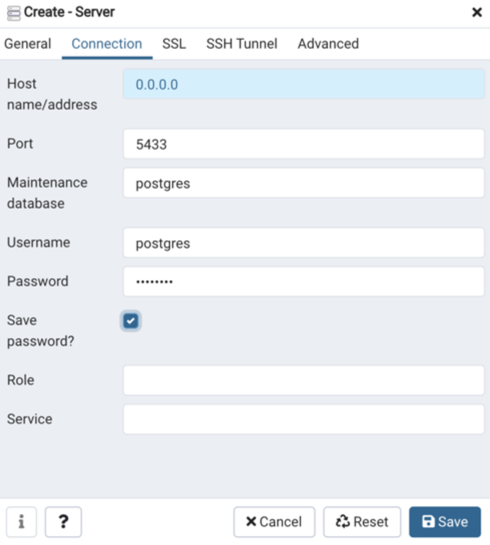
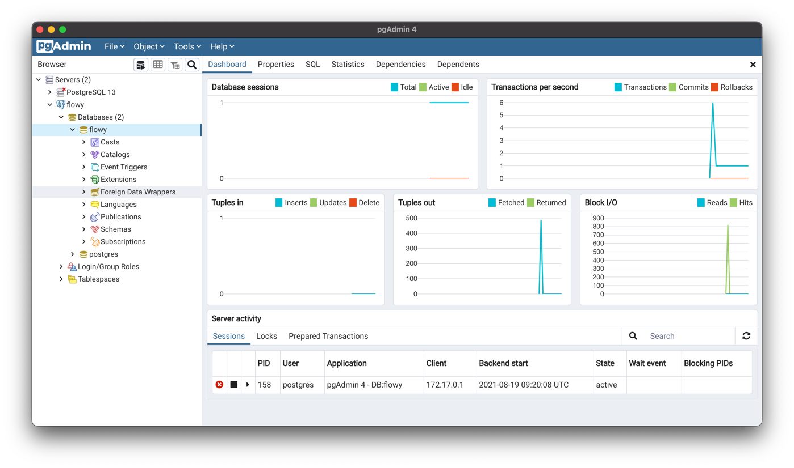

### Docker

1. follow the [instructions](https://docs.docker.com/desktop/mac/install/) to install docker.
2. open terminal and run: `docker pull postgres`
3run `make init_database`. It will create the database scheme on remote specified by DATABASE_URL. You can connect you database using 
pgAdmin.
   


The information you enter must be the same as the `make init_postgres`. e.g.
```
export DB_USER=postgres
export DB_PASSWORD=password
export DB_NAME=flowy
export DB_PORT=5432
```



[Docker command](https://docs.docker.com/engine/reference/commandline/builder_prune/)

### Run
By default, Docker images do not expose their ports to the underlying host machine. We need to do it explicitly using the -p flag.
`docker run -p 8000:8000 backend`


### Sqlx

**sqlx-cli**
*  [install sqlx-cli](https://github.com/launchbadge/sqlx/tree/master/sqlx-cli)

**Sqlx and Diesel commands** 
* create migration
    * sqlx: sqlx migrate add $(table)
    * diesel: diesel migration generation $(table)
    
* run migration
    * sqlx: sqlx migrate run
    * diesel: diesel migration run
    
* reset database
    * sqlx: sqlx database reset
    * diesel: diesel database reset

**offline mode**

`cargo sqlx prepare -- --bin backend`

**Type mapping**
* [postgres type map](https://docs.rs/sqlx/0.5.7/sqlx/postgres/types/index.html)
* [postgres and diesel type map](https://kotiri.com/2018/01/31/postgresql-diesel-rust-types.html)


## Q&A
1. Receive` { code: 24, kind: Other, message: "Too many open files" } on arbiter` after running cargo test on backend.
> This is due to a limit enforced by the operating system on the maximum number of open file descriptors (including sockets) for each process.
> Raising the file descriptor limit using `ulimit -n 2048` to solve this issue. It won't stay after reboot so check on google how to persist 
> that value if you want to.
> 
> or you can try:
> `launchctl limit maxfiles 2048 2048`
> `launchctl limit maxfiles`
> 
> Don't forget to relaunch your terminal.

## More
* [11-database-drivers](https://blog.logrocket.com/11-database-drivers-and-orms-for-rust-that-are-ready-for-production/) 
