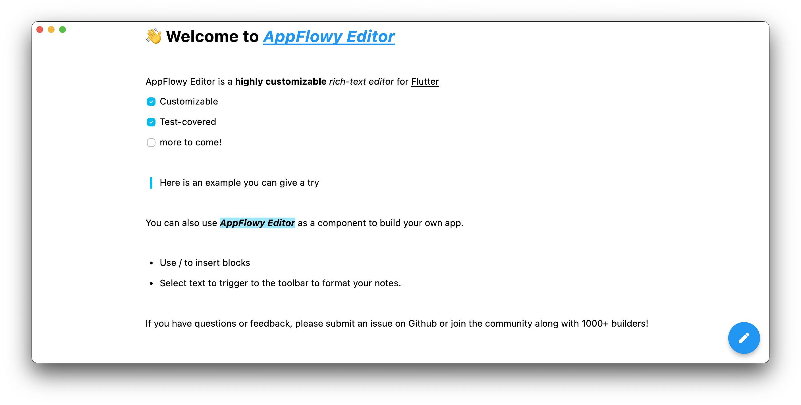
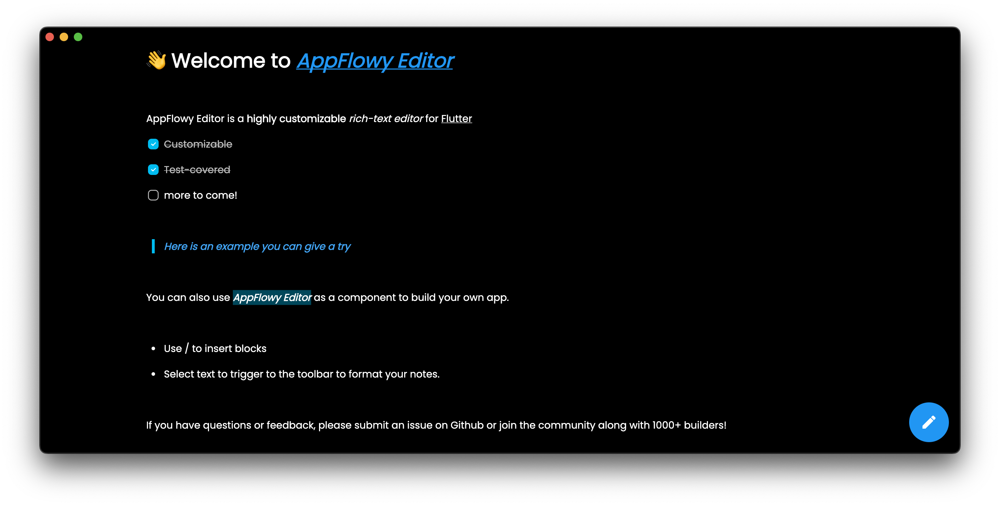

# Customizing Editor Features

## Customizing a Shortcut Event

We will use a simple example to illustrate how to quickly add a shortcut event.

In this example, text that starts and ends with an underscore ( \_ ) character will be rendered in italics for emphasis.  So typing `_xxx_` will automatically be converted into _xxx_.

Let's start with a blank document:

```dart
@override
Widget build(BuildContext context) {
  return Scaffold(
    body: Container(
      alignment: Alignment.topCenter,
      child: AppFlowyEditor(
        editorState: EditorState.empty(),
        editorStyle: EditorStyle.defaultStyle(),
        shortcutEvents: const [],
        customBuilders: const {},
      ),
    ),
  );
}
```

At this point, nothing magic will happen after typing `_xxx_`.


To implement our shortcut event we will create a `ShortcutEvent` instance to handle an underscore input.

We need to define `key` and `command` in a ShortCutEvent object to customize hotkeys. We recommend using the description of your event as a key. For example, if the underscore `_` is defined to make text italic, the key can be 'Underscore to italic'. 

> The command, made up of a single keyword such as `underscore` or a combination of keywords using the `+` sign in between to concatenate, is a condition that triggers a user-defined function. To see which keywords are available to define a command, please refer to [key_mapping.dart](../lib/src/service/shortcut_event/key_mapping.dart).
> If more than one commands trigger the same handler, then we use ',' to split them. For example, using CTRL and A or CMD and A to 'select all', we describe it as `cmd+a,ctrl+a`(case-insensitive).

```dart
import 'package:appflowy_editor/appflowy_editor.dart';
import 'package:flutter/material.dart';
import 'package:flutter/services.dart';

ShortcutEvent underscoreToItalicEvent = ShortcutEvent(
  key: 'Underscore to italic',
  command: 'underscore',
  handler: _underscoreToItalicHandler,
);

ShortcutEventHandler _underscoreToItalicHandler = (editorState, event) {

};
```

Then, we need to determine if the currently selected node is a `TextNode` and if the selection is collapsed.

If so, we will continue.

```dart
// ...
ShortcutEventHandler _underscoreToItalicHandler = (editorState, event) {
  // Obtain the selection and selected nodes of the current document through the 'selectionService'
  // to determine whether the selection is collapsed and whether the selected node is a text node.
  final selectionService = editorState.service.selectionService;
  final selection = selectionService.currentSelection.value;
  final textNodes = selectionService.currentSelectedNodes.whereType<TextNode>();
  if (selection == null || !selection.isSingle || textNodes.length != 1) {
    return KeyEventResult.ignored;
  }
```

Now, we deal with handling the underscore. 

Look for the position of the previous underscore and 
1. if one is _not_ found, return without doing anything. 
2. if one is found, the text enclosed within the two underscores will be formatted to display in italics.

```dart
// ...
ShortcutEventHandler _underscoreToItalicHandler = (editorState, event) {
  // ...

  final textNode = textNodes.first;
  final text = textNode.toRawString();
  // Determine if an 'underscore' already exists in the text node
  final previousUnderscore = text.indexOf('_');
  if (previousUnderscore == -1) {
    return KeyEventResult.ignored;
  }

  // Delete the previous 'underscore',
  // update the style of the text surrounded by the two underscores to 'italic',
  // and update the cursor position.
  TransactionBuilder(editorState)
    ..deleteText(textNode, previousUnderscore, 1)
    ..formatText(
      textNode,
      previousUnderscore,
      selection.end.offset - previousUnderscore - 1,
      {'italic': true},
    )
    ..afterSelection = Selection.collapsed(
      Position(path: textNode.path, offset: selection.end.offset - 1),
    )
    ..commit();

  return KeyEventResult.handled;
};
```

Now our 'underscore handler' function is done and the only task left is to inject it into the AppFlowyEditor.

```dart
@override
Widget build(BuildContext context) {
  return Scaffold(
    body: Container(
      alignment: Alignment.topCenter,
      child: AppFlowyEditor(
        editorState: EditorState.empty(),
        editorStyle: EditorStyle.defaultStyle(),
        customBuilders: const {},
        shortcutEvents: [
            _underscoreToItalicHandler,
        ],
      ),
    ),
  );
}
```


Check out the [complete code](https://github.com/AppFlowy-IO/AppFlowy/blob/main/frontend/app_flowy/packages/appflowy_editor/example/lib/plugin/underscore_to_italic_key_event_handler.dart) file of this example.


## Customizing a Component
We will use a simple example to show how to quickly add a custom component.

In this example we will render an image from the network.

Let's start with a blank document:

```dart
@override
Widget build(BuildContext context) {
  return Scaffold(
    body: Container(
      alignment: Alignment.topCenter,
      child: AppFlowyEditor(
        editorState: EditorState.empty(),
        editorStyle: EditorStyle.defaultStyle(),
        shortcutEvents: const [],
        customBuilders: const {},
      ),
    ),
  );
}
```

Next, we will choose a unique string for your custom node's type. 

We'll use `network_image` in this case. And we add `network_image_src` to the `attributes` to describe the link of the image.

```JSON
{
  "type": "network_image",
  "attributes": {
    "network_image_src": "https://docs.flutter.dev/assets/images/dash/dash-fainting.gif"
  }
}
```

Then, we create a class that inherits [NodeWidgetBuilder](../lib/src/service/render_plugin_service.dart). As shown in the autoprompt, we need to implement two functions:
1. one returns a widget 
2. the other verifies the correctness of the [Node](../lib/src/document/node.dart).


```dart
import 'package:appflowy_editor/appflowy_editor.dart';
import 'package:flutter/material.dart';

class NetworkImageNodeWidgetBuilder extends NodeWidgetBuilder {
  @override
  Widget build(NodeWidgetContext<Node> context) {
    throw UnimplementedError();
  }

  @override
  NodeValidator<Node> get nodeValidator => throw UnimplementedError();
}
```

Now, let's implement a simple image widget based on `Image`.

Note that the `State` object that is returned by the `Widget` must implement [Selectable](../lib/src/render/selection/selectable.dart) using the `with` keyword.

```dart
class _NetworkImageNodeWidget extends StatefulWidget {
  const _NetworkImageNodeWidget({
    Key? key,
    required this.node,
  }) : super(key: key);

  final Node node;

  @override
  State<_NetworkImageNodeWidget> createState() =>
      __NetworkImageNodeWidgetState();
}

class __NetworkImageNodeWidgetState extends State<_NetworkImageNodeWidget>
    with Selectable {
  RenderBox get _renderBox => context.findRenderObject() as RenderBox;

  @override
  Widget build(BuildContext context) {
    return Image.network(
      widget.node.attributes['network_image_src'],
      height: 200,
      loadingBuilder: (context, child, loadingProgress) =>
          loadingProgress == null ? child : const CircularProgressIndicator(),
    );
  }

  @override
  Position start() => Position(path: widget.node.path, offset: 0);

  @override
  Position end() => Position(path: widget.node.path, offset: 1);

  @override
  Position getPositionInOffset(Offset start) => end();

  @override
  List<Rect> getRectsInSelection(Selection selection) =>
      [Offset.zero & _renderBox.size];

  @override
  Selection getSelectionInRange(Offset start, Offset end) => Selection.single(
        path: widget.node.path,
        startOffset: 0,
        endOffset: 1,
      );

  @override
  Offset localToGlobal(Offset offset) => _renderBox.localToGlobal(offset);
}
```

Finally, we return `_NetworkImageNodeWidget` in the `build` function of `NetworkImageNodeWidgetBuilder`...

```dart
class NetworkImageNodeWidgetBuilder extends NodeWidgetBuilder {
  @override
  Widget build(NodeWidgetContext<Node> context) {
    return _NetworkImageNodeWidget(
      key: context.node.key,
      node: context.node,
    );
  }

  @override
  NodeValidator<Node> get nodeValidator => (node) {
        return node.type == 'network_image' &&
            node.attributes['network_image_src'] is String;
      };
}
```

... and register `NetworkImageNodeWidgetBuilder` in the `AppFlowyEditor`.
 
```dart
final editorState = EditorState(
  document: StateTree.empty()
    ..insert(
      [0],
      [
        TextNode.empty(),
        Node.fromJson({
          'type': 'network_image',
          'attributes': {
            'network_image_src':
                'https://docs.flutter.dev/assets/images/dash/dash-fainting.gif'
          }
        })
      ],
    ),
);
return AppFlowyEditor(
  editorState: editorState,
  editorStyle: EditorStyle.defaultStyle(),
  shortcutEvents: const [],
  customBuilders: {
    'network_image': NetworkImageNodeWidgetBuilder(),
  },
);
```


Check out the [complete code](https://github.com/AppFlowy-IO/AppFlowy/blob/main/frontend/app_flowy/packages/appflowy_editor/example/lib/plugin/network_image_node_widget.dart) file of this example.

## Customizing a Theme (New Feature in 0.0.5, Alpha)

We will use a simple example to illustrate how to quickly customize a theme.

Let's start with a blank document:

```dart
@override
Widget build(BuildContext context) {
  return Scaffold(
    body: Container(
      alignment: Alignment.topCenter,
      child: AppFlowyEditor(
        editorState: EditorState.empty(),
        editorStyle: EditorStyle.defaultStyle(),
        shortcutEvents: const [],
        customBuilders: const {},
      ),
    ),
  );
}
```

At this point, the editor looks like ...



Next, we will customize the `EditorStyle`.

```dart
EditorStyle _customizedStyle() {
  final editorStyle = EditorStyle.defaultStyle();
  return editorStyle.copyWith(
    cursorColor: Colors.white,
    selectionColor: Colors.blue.withOpacity(0.3),
    textStyle: editorStyle.textStyle.copyWith(
      defaultTextStyle: GoogleFonts.poppins().copyWith(
        color: Colors.white,
        fontSize: 14.0,
      ),
      defaultPlaceholderTextStyle: GoogleFonts.poppins().copyWith(
        color: Colors.white.withOpacity(0.5),
        fontSize: 14.0,
      ),
      bold: const TextStyle(fontWeight: FontWeight.w900),
      code: TextStyle(
        fontStyle: FontStyle.italic,
        color: Colors.red[300],
        backgroundColor: Colors.grey.withOpacity(0.3),
      ),
      highlightColorHex: '0x6FFFEB3B',
    ),
    pluginStyles: {
      'text/quote': builtInPluginStyle
        ..update(
          'textStyle',
          (_) {
            return (EditorState editorState, Node node) {
              return TextStyle(
                color: Colors.blue[200],
                fontStyle: FontStyle.italic,
                fontSize: 12.0,
              );
            };
          },
        ),
    },
  );
}
```

Now our 'customize style' function is done and the only task left is to inject it into the AppFlowyEditor.

```dart
@override
Widget build(BuildContext context) {
  return Scaffold(
    body: Container(
      alignment: Alignment.topCenter,
      child: AppFlowyEditor(
        editorState: EditorState.empty(),
        editorStyle: _customizedStyle(),
        shortcutEvents: const [],
        customBuilders: const {},
      ),
    ),
  );
}
```

