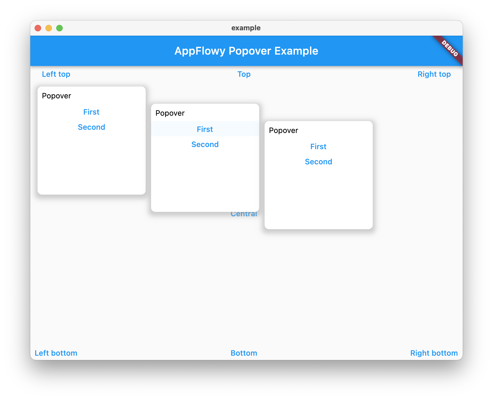

# AppFlowy Popover

A Popover can be used to display some content on top of another.

It can be used to display a dropdown menu.

> A popover is a transient view that appears above other content onscreen when you tap a control or in an area. Typically, a popover includes an arrow pointing to the location from which it emerged. Popovers can be nonmodal or modal. A nonmodal popover is dismissed by tapping another part of the screen or a button on the popover. A modal popover is dismissed by tapping a Cancel or other button on the popover.

Source: [Human Interface Guidelines](https://developer.apple.com/design/human-interface-guidelines/ios/views/popovers/).

## Features

- Basic popover style
- Follow the target automatically
- Nested popover support
- Exclusive API



## Example

```dart
Popover(
  // Define how to trigger the popover
  triggerActions: PopoverTriggerActionFlags.click,
  child: TextButton(child: Text("Popover"), onPressed: () {}),
  // Define the direction of the popover
  direction: PopoverDirection.bottomWithLeftAligned,
  popupBuilder(BuildContext context) {
    return PopoverMenu();
  },
);
```

### Trigger the popover manually

Sometimes, if you want to trigger the popover manually, you can use a `PopoverController`.

```dart
class MyWidgetState extends State<GridDateCell> {
  late PopoverController _popover;

  @override
  void initState() {
    _popover = PopoverController();
    super.initState();
  }

  // triggered by another widget
  _onClick() {
    _popover.show();
  }

  @override
  Widget build(BuildContext context) {
    return Popover(
      controller: _popover,
      ...
    )
  }
}
```

### Make several popovers exclusive

The popover has a mechanism to make sure there are only one popover is shown in a group of popovers.
It's called `PopoverMutex`.

If you pass the same mutex object to the popovers, there will be only one popover is triggered.

```dart
class MyWidgetState extends State<GridDateCell> {
  final _popoverMutex = PopoverMutex();

  @override
  Widget build(BuildContext context) {
    return Row(
      children: [
        Popover(
          mutex: _popoverMutex,
          ...
        ),
        Popover(
          mutex: _popoverMutex,
          ...
        ),
        Popover(
          mutex: _popoverMutex,
          ...
        ),
      ]
    )
  }
}
```

## API

| Param          | Description                                                      | Type                                    |
| -------------- | ---------------------------------------------------------------- | --------------------------------------- |
| offset         | The offset between the popover and the child                     | `Offset`                                |
| popupBuilder   | The function used to build the popover                           | `Widget Function(BuildContext context)` |
| triggerActions | Define the actions about how to trigger the popover              | `int`                                   |
| mutex          | If multiple popovers are exclusive, pass the same mutex to them. | `PopoverMutex`                          |
| direction      | The direction where the popover should be placed                 | `PopoverDirection`                      |
| onClose        | The callback will be called after the popover is closed          | `void Function()`                       |
| child          | The child to trigger the popover                                 | `Widget`                                |
