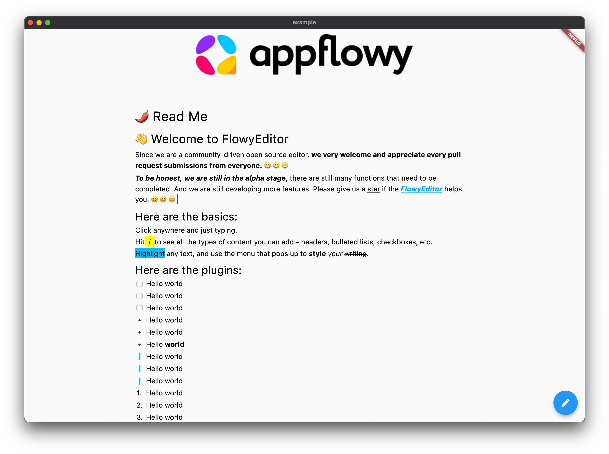

<!-- 
This README describes the package. If you publish this package to pub.dev,
this README's contents appear on the landing page for your package.

For information about how to write a good package README, see the guide for
[writing package pages](https://dart.dev/guides/libraries/writing-package-pages). 

For general information about developing packages, see the Dart guide for
[creating packages](https://dart.dev/guides/libraries/create-library-packages)
and the Flutter guide for
[developing packages and plugins](https://flutter.dev/developing-packages). 
-->

<center><big><b>FlowyEditor</b></big></center>

<p align="center">An easily extensible, test-covered rich text editing component for Flutter</p>



## Features

* Extensible
    * Support for extending different styles of views.
    * 支持扩展不同样式的视图
    * Support extending custom shortcut key parsing
    * 支持扩展自定义快捷键解析
    * Support extending toolbar/popup list(WIP)
    * 支持扩展toolbar/popup list(WIP)
    * ...
* Collaboration Ready
    * All changes to the document are based on **operation**. Theoretically, collaborative editing will be supported in the future.
    * 所有对文档的修改都是基于operation。理论上未来会支持协同编辑。
* Good stability guarantees
    * Current code coverage >= 60%, we will still continue to add more test cases.

> 由于可扩展的结构，以及随着功能的增多，我们鼓励每个提交的文件或者代码段，都可以在test下增加对应的测试用例代码，尽可能得保证提交者不需要担心自己的代码影响了已有的逻辑。

> Due to the extensible structure and the increase in functionality, we encourage each commit to add test case code under test to ensure that the committer does not have to worry about their code affecting the existing logic as much as possible.


## Getting started

```shell
flutter pub add flowy_editor
flutter pub get
```

## Usage

Creates editor with empty document
```dart
final editorState = EditorState.empty();
final editor = FlowyEditor(
    editorState: editorState,
    keyEventHandlers: const [],
    customBuilders: const {},
);
```

Creates editor from JSON file
```dart
final json = ...;
final editorState = EditorState(StateTree.fromJson(data));
final editor = FlowyEditor(
    editorState: editorState,
    keyEventHandlers: const [],
    customBuilders: const {},
);
```

For more. Run the example.
```shell
git clone https://github.com/AppFlowy-IO/AppFlowy.git
cd frontend/app_flowy/packages/flowy_editor/example
flutter run
```

## Examples
* 样式扩展
    * Checkbox text - 展示如何基于已有的富文本组件扩展新的样式，
    * Image - 展示如何扩展新的节点，并且渲染
* 快捷键扩展
    * BUIS - 展示如何通过快捷键对文字进行加粗/下划线/斜体/加粗
    * 粘贴HTML - 展示如何通过快捷键处理粘贴的样式

## Glossary


## Contributing
Contributions are what make the open source community such an amazing place to be learn, inspire, and create. Any contributions you make are greatly appreciated. Please look at [CONTRIBUTING.md](documentation/contributing.md) for details.