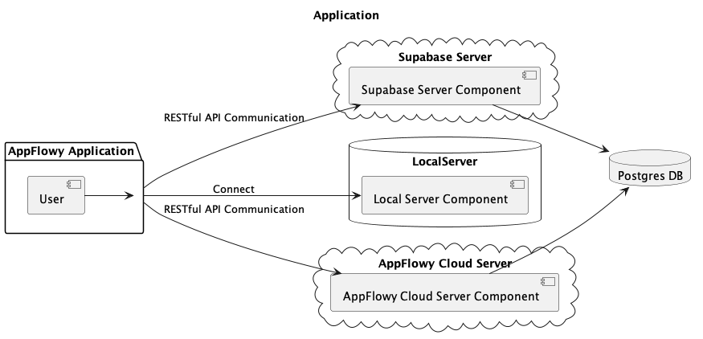
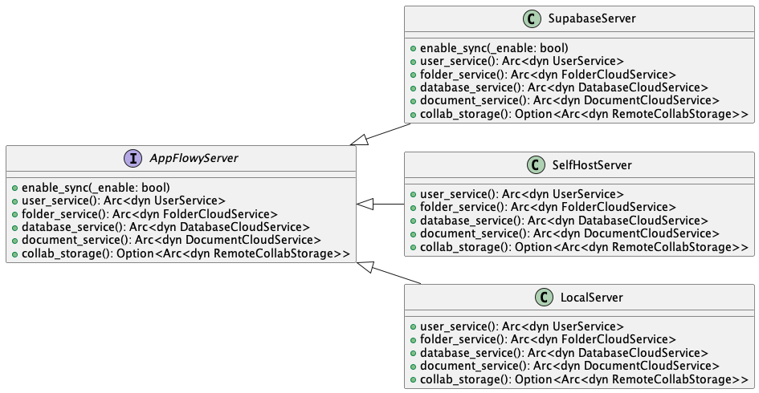
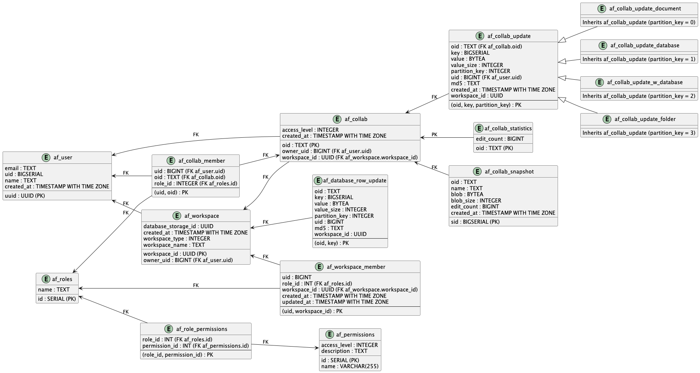
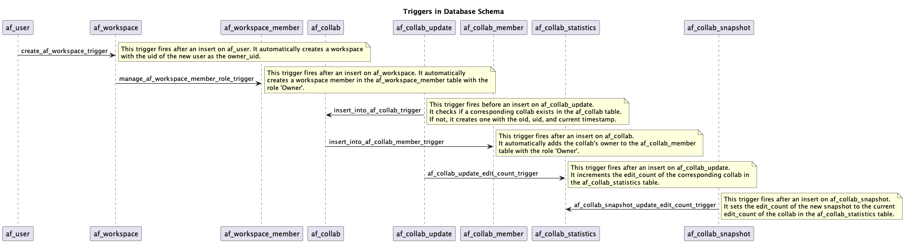

# AppFlowy Cloud Architecture

AppFlowy supports multiple cloud solutions. Users can choose their preferred cloud provider, such as Supabase, Firebase,
AWS, or our own AppFlowyCloud (Self-hosted server).



## Design

AppFlowy use the traits [AppFlowyServer] to abstract the cloud provider. Each cloud provider implements the [AppFlowyServer]
trait. As the image below shows. Users can choose their preferred cloud provider or simply use the default option, which is the LocalServer. When using the
LocalServer, data is stored on the local file system. Users can migrate to a cloud provider if needed. For instance, one
could migrate from LocalServer to AppFlowyCloud. This migration would create a new user in the cloud and transfer all the
data from the local database to the cloud.



## AppFlowy Cloud Implementation (WIP)

### Restful API

### Table schema

## Supabase Implementation

### Table schema


1. `af_roles` table: This table contains a list of roles that are used in your application, such as 'Owner', 'Member', and 'Guest'.

2. `af_permissions` table: This table stores permissions that are used in your application. Each permission has a name, a description, and an access level.

3. `af_role_permissions` table: This is a many-to-many relation table between roles and permissions. It represents which permissions a role has.

4. `af_user` table: This stores the details of users like uuid, email, uid, name, created_at. Here, uid is an auto-incrementing integer that uniquely identifies a user.

5. `af_workspace` table: This table contains all the workspaces. Each workspace has an owner which is associated with the uid of a user in the `af_user` table.

6. `af_workspace_member` table: This table maintains a list of all the members associated with a workspace and their roles.

7. `af_collab` and `af_collab_member` tables: These tables store the collaborations and their members respectively. Each collaboration has an owner and a workspace associated with it.

8. `af_collab_update`, `af_collab_update_document`, `af_collab_update_database`, `af_collab_update_w_database`, `af_collab_update_folder`, `af_database_row_update` tables: These tables are used for handling updates to collaborations.

9. `af_collab_statistics`, `af_collab_snapshot`, `af_collab_state`: These tables and view are used for maintaining statistics and snapshots of collaborations.

10. `af_user_profile_view` view: This view is used to get the latest workspace_id for each user.


Here's a detailed description for each of these triggers:

1. `create_af_workspace_trigger`:

   This trigger is designed to automate the process of workspace creation in the `af_workspace` table after a new user is inserted into the `af_user` table. When a new user is added, this trigger fires and inserts a new record into the `af_workspace` table, setting the `owner_uid` to the UID of the new user.

2. `manage_af_workspace_member_role_trigger`:

   This trigger helps to manage the roles of workspace members. After an insert operation on the `af_workspace` table, this trigger automatically fires and creates a new record in the `af_workspace_member` table. The new record identifies the user as a member of the workspace with the role 'Owner'. This ensures that every new workspace has an owner.

3. `insert_into_af_collab_trigger`:

   The purpose of this trigger is to ensure consistency between the `af_collab_update` and `af_collab` tables. When an insert operation is about to be performed on the `af_collab_update` table, this trigger fires before the insert operation. It checks if a corresponding collaboration exists in the `af_collab` table using the oid and uid. If a corresponding collaboration does not exist, the trigger creates one, using the oid, uid, and current timestamp. This way, every collab update operation corresponds to a valid collaboration.

4. `insert_into_af_collab_member_trigger`:

   This trigger helps to manage the membership of users in collaborations. After a new collaboration is inserted into the `af_collab` table, this trigger fires. It checks if a corresponding collaboration member exists in the `af_collab_member` table. If a corresponding member does not exist, the trigger creates one, using the collaboration id and user id. This ensures that every collaboration has at least one member.

5. `af_collab_snapshot_update_edit_count_trigger`:

   This trigger is designed to keep track of the number of edits on each collaboration snapshot in the `af_collab_snapshot` table. When an update operation is performed on the `af_collab_snapshot` table, this trigger fires. It increments the `edit_count` of the corresponding record in the `af_collab_snapshot` table by one. This ensures that the application can keep track of how many times each collaboration snapshot has been edited.


### Supabase configuration

#### Test
In order to run the test, you need to set up the .env.test file.
```dotenv
# Supabase configuration
SUPABASE_URL="your-supabase-url"
SUPABASE_ANON_KEY="your-supabase-anonymous-key"
SUPABASE_KEY="your-supabase-key"
SUPABASE_JWT_SECRET="your-supabase-jwt-secret"

# Supabase Database configuration
SUPABASE_DB="your-supabase-db-url"
SUPABASE_DB_USER="your-db-username"
SUPABASE_DB_PORT="your-db-port"
SUPABASE_DB_PASSWORD="your-db-password"
```

1. `SUPABASE_URL`: This is the URL of your Supabase server instance. Your application will use this URL to interact with the Supabase service.

2. `SUPABASE_ANON_KEY`: This is the anonymous API key from Supabase, used for operations that don't require user authentication. Operations performed with this key are done as the anonymous role in the database.

3. `SUPABASE_KEY`: This is the API key with higher privileges from Supabase. It is generally used for server-side operations that require more permissions than an anonymous user.

4. `SUPABASE_JWT_SECRET`: This is the secret used to verify JWT tokens generated by Supabase. JWT or JSON Web Token is a standard method for securely transferring data between parties as a JSON object.

5. `SUPABASE_DB`: This is the URL for the database your Supabase server instance is using.

6. `SUPABASE_DB_USER`: This is the username used to authenticate with the Supabase database, in this case, it's 'postgres', which is a common default for PostgreSQL.

7. `SUPABASE_DB_PORT`: This is the port number where your Supabase database service is accessible. The default PostgreSQL port is 5432, and you are using this default port.

8. `SUPABASE_DB_PASSWORD`: This is the password used to authenticate the `SUPABASE_DB_USER` with the Supabase database.

For example, if you want to run the supabase tests located in flowy-test crate. You need to put the `.env.test` file under
the flowy-test folder.