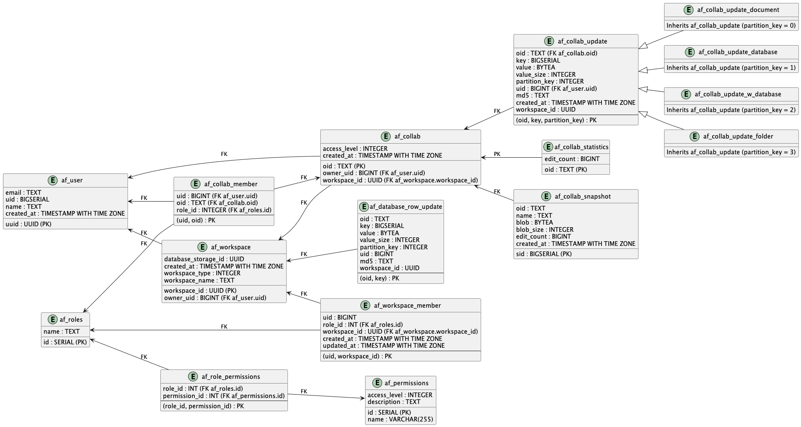

1. `af_roles` table: This table contains a list of roles that are used in your application, such as 'Owner', 'Member', and 'Guest'.

2. `af_permissions` table: This table stores permissions that are used in your application. Each permission has a name, a description, and an access level.

3. `af_role_permissions` table: This is a many-to-many relation table between roles and permissions. It represents which permissions a role has.

4. `af_user` table: This stores the details of users like uuid, email, uid, name, created_at. Here, uid is an auto-incrementing integer that uniquely identifies a user.

5. `af_workspace` table: This table contains all the workspaces. Each workspace has an owner which is associated with the uid of a user in the `af_user` table.

6. `af_workspace_member` table: This table maintains a list of all the members associated with a workspace and their roles.

7. `af_collab` and `af_collab_member` tables: These tables store the collaborations and their members respectively. Each collaboration has an owner and a workspace associated with it.

8. `af_collab_update`, `af_collab_update_document`, `af_collab_update_database`, `af_collab_update_w_database`, `af_collab_update_folder`, `af_database_row_update` tables: These tables are used for handling updates to collaborations.

9. `af_collab_statistics`, `af_collab_snapshot`, `af_collab_state`: These tables and view are used for maintaining statistics and snapshots of collaborations.

10. `af_user_profile_view` view: This view is used to get the latest workspace_id for each user.

Here's a detailed description for each of these triggers:

1. `create_af_workspace_trigger`:

   This trigger is designed to automate the process of workspace creation in the `af_workspace` table after a new user is inserted into the `af_user` table. When a new user is added, this trigger fires and inserts a new record into the `af_workspace` table, setting the `owner_uid` to the UID of the new user.

2. `manage_af_workspace_member_role_trigger`:

   This trigger helps to manage the roles of workspace members. After an insert operation on the `af_workspace` table, this trigger automatically fires and creates a new record in the `af_workspace_member` table. The new record identifies the user as a member of the workspace with the role 'Owner'. This ensures that every new workspace has an owner.

3. `insert_into_af_collab_trigger`:

   The purpose of this trigger is to ensure consistency between the `af_collab_update` and `af_collab` tables. When an insert operation is about to be performed on the `af_collab_update` table, this trigger fires before the insert operation. It checks if a corresponding collaboration exists in the `af_collab` table using the oid and uid. If a corresponding collaboration does not exist, the trigger creates one, using the oid, uid, and current timestamp. This way, every collab update operation corresponds to a valid collaboration.

4. `insert_into_af_collab_member_trigger`:

   This trigger helps to manage the membership of users in collaborations. After a new collaboration is inserted into the `af_collab` table, this trigger fires. It checks if a corresponding collaboration member exists in the `af_collab_member` table. If a corresponding member does not exist, the trigger creates one, using the collaboration id and user id. This ensures that every collaboration has at least one member.

5. `af_collab_snapshot_update_edit_count_trigger`:

   This trigger is designed to keep track of the number of edits on each collaboration snapshot in the `af_collab_snapshot` table. When an update operation is performed on the `af_collab_snapshot` table, this trigger fires. It increments the `edit_count` of the corresponding record in the `af_collab_snapshot` table by one. This ensures that the application can keep track of how many times each collaboration snapshot has been edited.